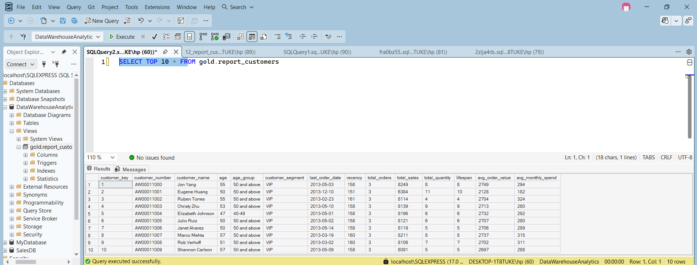

# SQL Data Analytics Project (Exploratory Data Analysis)

## 📌 Project Overview
This project uses SQL to explore and analyze sales data. The objective is to answer business questions, identify trends, and generate actionable insights using SQL queries.

## 🎯 Problem Statement
Businesses collect large volumes of sales data but often struggle to extract meaningful insights. This project demonstrates how SQL can be used to analyze sales performance, customer behavior, and product trends.

## 🛠️ Tools & Technologies
- Microsoft SQL Server
- SQL Server Management Studio (SSMS)

## 📂 Project Structure
datasets/
docs/
scripts/
README.md

## 📊 Analysis Performed
- Database Exploration
- Measures & Metrics
- Time-Based Analysis
- Cumulative Analysis
- Customer Segmentation
- Product Performance
- Ranking Analysis
- Change Over Time Analysis

## 📈 Key Business Questions
- Which products generate the highest revenue?
- Which customers spend the most?
- How do monthly and yearly sales compare?
- Which categories perform best?
- What are the overall sales trends?

## 🚀 Skills Demonstrated
- SQL Joins
- Aggregate Functions
- GROUP BY
- CASE Statements
- Common Table Expressions (CTEs)
- Window Functions
- Date Functions
- Subqueries

## 📁 Dataset
Sales dataset containing customer, product, and sales information.

## 📸 Sample Output

### Customer Performance Report

This report summarizes customer purchasing behavior by analyzing total sales, total orders, average order value, recency, and customer segments. It helps identify high-value customers and supports data-driven business decisions.

